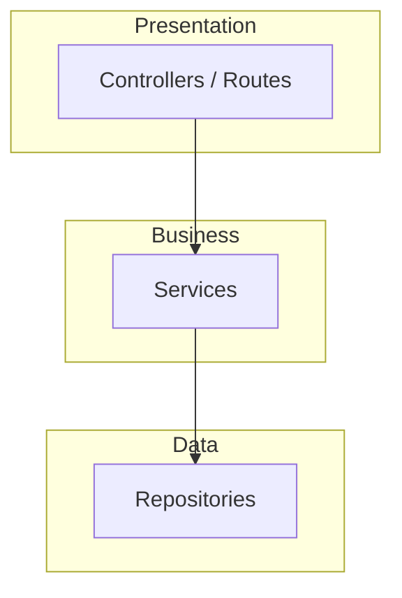
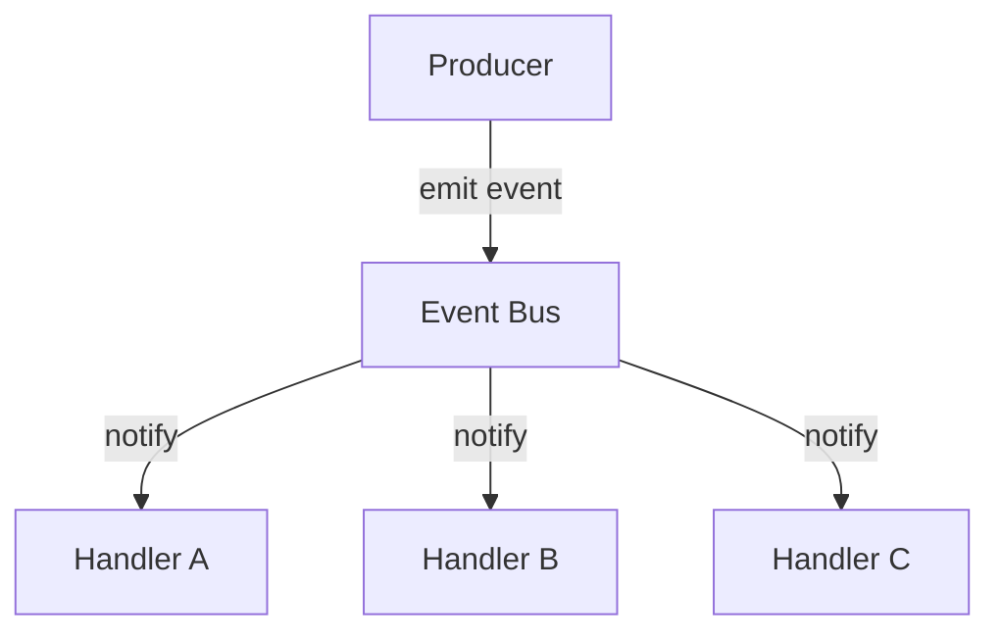
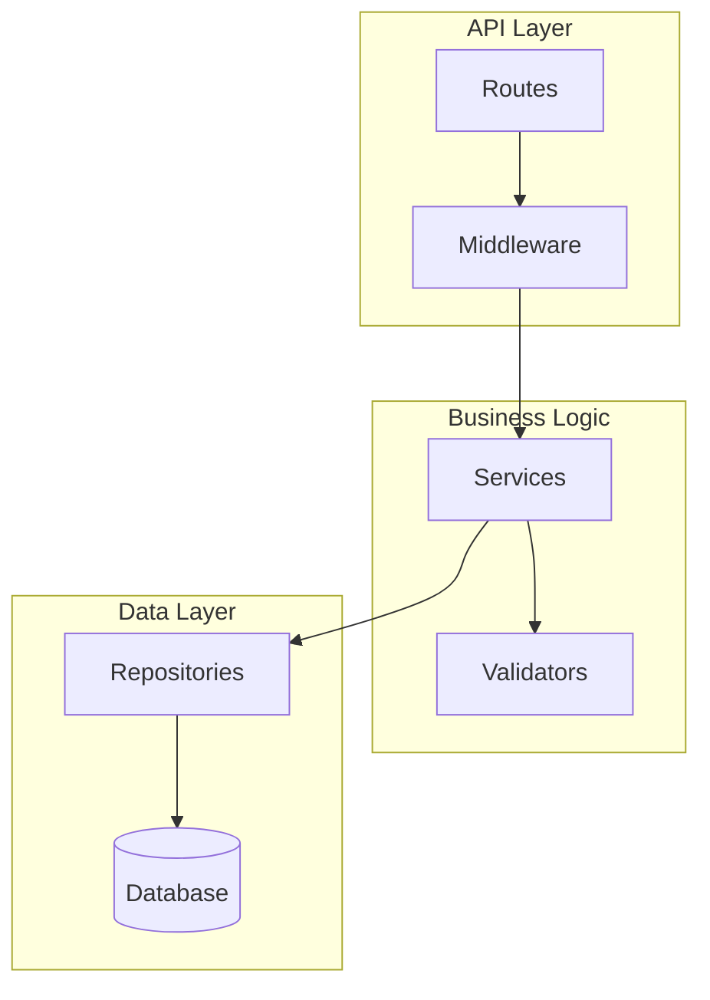

# Architecture Patterns — Skill Reference for AI Assistants

> Common software architecture patterns, how to recognize them in code, and how to diagram them. Use this reference when exploring codebases and mapping system structure.

## Patterns to Recognize

### Layered Architecture

Horizontal layers where each layer depends only on the layer below it.

**Signals:**
- Directories named `controllers/`, `services/`, `repositories/`, `models/`
- Imports flow one direction: controller → service → repository → database
- Each layer has a distinct responsibility (routing, business logic, data access)
- No "skip-layer" imports (controller doesn't import repository directly)

**Common in:** Web APIs (Express, Spring Boot, Django), enterprise applications

**Mermaid:**

### MVC / MVVM

Separates data (Model), display (View), and coordination (Controller/ViewModel).

**Signals:**
- Directories or files named `models/`, `views/`, `controllers/` or `viewmodels/`
- Views import from models or viewmodels but not from data access
- Controller/ViewModel mediates between View and Model
- Data binding patterns (MVVM): view state derived from observable model

**Common in:** Web frameworks (Rails, Django, ASP.NET), mobile apps (SwiftUI, Android)

### Event-Driven / Message-Based

Components communicate through events or messages rather than direct calls.

**Signals:**
- Event emitters, listeners, subscribers, handlers
- Message queues, pub/sub, event bus patterns
- `on()`, `emit()`, `subscribe()`, `publish()` function calls
- Loose coupling: producers don't know who consumes their events
- Event type definitions or message schemas

**Common in:** Real-time systems, microservices, UI frameworks (React, Vue)

**Mermaid:**

### Pipes and Filters

Data flows through a sequence of processing steps, each transforming it.

**Signals:**
- Middleware chains (Express, Koa)
- Pipeline patterns: `input | step1 | step2 | output`
- Each step takes input, transforms it, passes output to next step
- Steps are composable and reorderable
- Functions that take and return the same shape of data

**Common in:** CLI tools (Unix pipes), web middleware, data processing, build systems

### Plugin / Extension Architecture

Core system with extension points that plugins can hook into.

**Signals:**
- Plugin registration APIs, hook systems, extension points
- Configuration that lists plugins to load
- Interface or abstract base class that plugins implement
- Dynamic loading or dependency injection
- `register()`, `use()`, `addPlugin()` patterns

**Common in:** Editors (VS Code), build tools (Webpack, Babel), CMS (WordPress)

### Microservices

Multiple independently deployable services communicating over the network.

**Signals:**
- Multiple `package.json` / `go.mod` / `Cargo.toml` files (multi-project)
- API clients for calling other services
- Shared proto files or API schemas
- Docker/Kubernetes configuration for multiple services
- Service discovery, circuit breakers, API gateways

**Common in:** Large-scale web applications, cloud-native systems

### Monolith (Modular)

Single deployable unit organized into well-defined internal modules.

**Signals:**
- One `package.json` or build config for the entire application
- Internal module boundaries enforced by directory structure
- Shared database, single deployment process
- Feature directories (`features/auth/`, `features/billing/`) with internal structure

**Common in:** Most applications, especially early-stage projects

## Module Boundary Heuristics

A module boundary exists where:

| Heuristic | How to detect |
|-----------|---------------|
| **Directory boundary** | Top-level directories often represent modules |
| **Package boundary** | Separate `package.json`, `go.mod`, or build config |
| **Export boundary** | An `index.ts` or `__init__.py` that re-exports a public API |
| **Type boundary** | Interfaces or types that define a contract between modules |
| **Dependency direction** | If A imports B but B never imports A, they're separate modules with A depending on B |
| **Naming convention** | Consistent prefixes or suffixes grouping related files |
| **Test boundary** | Tests organized to match module structure |

## Dependency Direction Analysis

Dependency direction reveals architecture:

- **Healthy:** Dependencies flow from outer layers to inner layers (controllers → services → models)
- **Concerning:** Circular dependencies between modules (A imports B, B imports A)
- **Inverted:** Inner layers depend on outer layers (model imports controller) — usually a design flaw
- **Hub:** One module that everything depends on — could be appropriate (shared types) or a bottleneck

### How to Check

1. Pick a module. List its imports.
2. For each import, check if the imported module ever imports back.
3. Draw arrows. If arrows form cycles, there's coupling to investigate.

## Mermaid Diagram Conventions

### For Architecture Diagrams

Use `flowchart TD` (top-down) for layered systems, `flowchart LR` (left-right) for pipelines.

**Node shapes:**
- `[Rectangle]` — Module or component
- `([Stadium])` — Entry point or external interface
- `[(Database)]` — Data store
- `{Diamond}` — Decision point

**Arrow styles:**
- `-->` Solid arrow: direct dependency or call
- `-.->` Dashed arrow: indirect dependency, event, or async communication
- `==>` Thick arrow: data flow (primary path)

**Subgraphs for module boundaries:**

### Guidelines

- Keep diagrams focused: 5-15 nodes maximum
- Use subgraphs to group related components
- Label arrows when the relationship isn't obvious
- Show the most important relationships, not every import
- One diagram per concern: don't mix architecture and data flow in the same diagram
