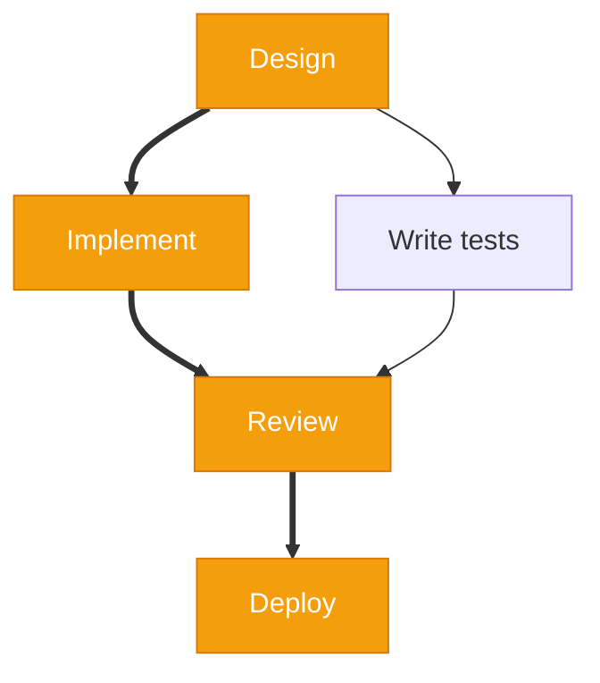
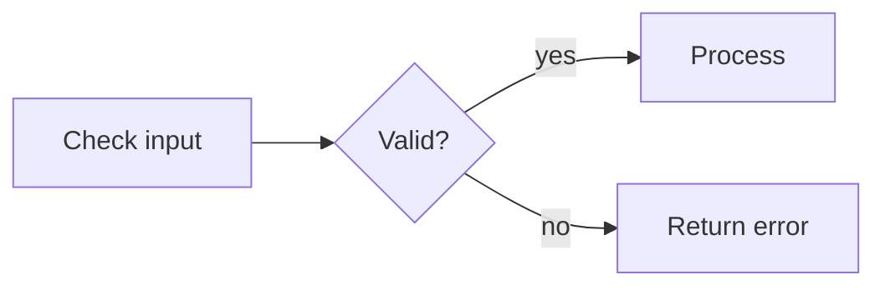
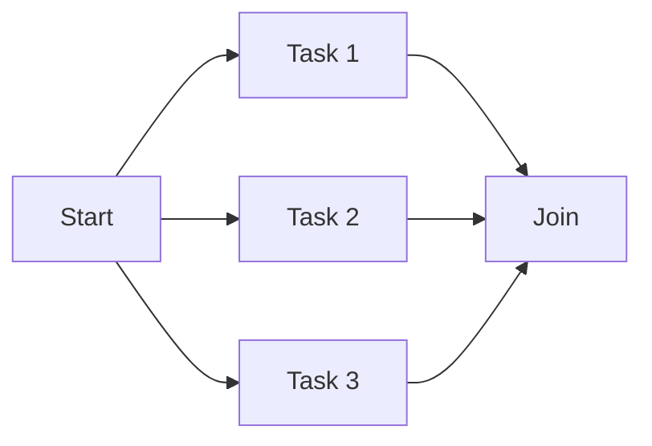
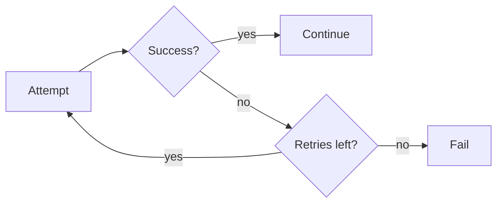
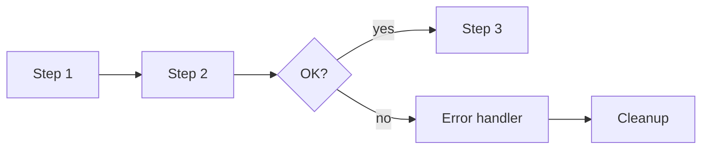
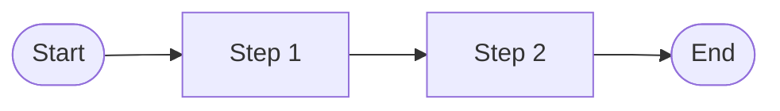
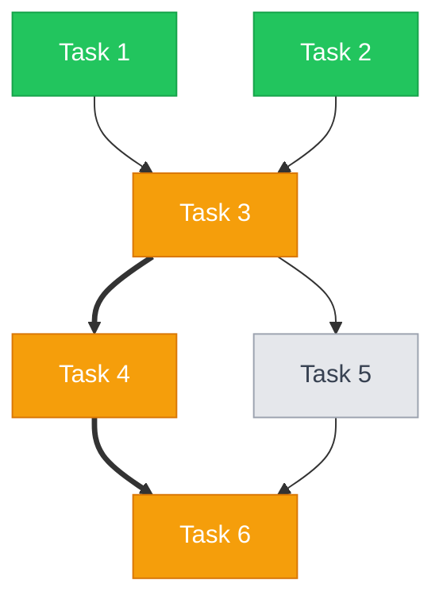
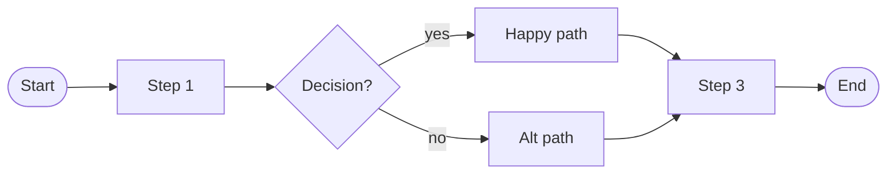

# Mermaid Flowcharts — Skill Reference for AI Assistants

> Conventions for generating clean, readable Mermaid diagrams from task graphs and process flows. Use this reference when producing Mermaid output.

## Direction Conventions

| Direction | Use For | Example |
|-----------|---------|---------|
| `flowchart TD` | Task dependencies (top-down hierarchy) | Sprint backlog, build order |
| `flowchart LR` | Process flows, timelines, pipelines (left-to-right sequence) | CI/CD pipeline, approval workflow |

**Rule:** Dependencies flow top-down. Time flows left-to-right.

## Node Shapes

Use at most 3 shapes per diagram for readability.

| Shape | Syntax | Use For |
|-------|--------|---------|
| Rectangle | `A[Task name]` | Standard tasks / steps |
| Rounded | `A(Task name)` | Start / end points |
| Diamond | `A{Decision?}` | Decision points, branch conditions |
| Stadium | `A([Task name])` | Start / end markers in process flows |
| Hexagon | `A{{Task name}}` | Preparation / setup steps |

**Default for task graphs:** Rectangle for tasks, that's it. Keep it simple.
**Default for process flows:** Stadium for start/end, rectangle for steps, diamond for decisions.

## Edge Styles

| Style | Syntax | Use For |
|-------|--------|---------|
| Solid arrow | `A --> B` | Normal dependency / flow |
| Solid with label | `A -->|label| B` | Labeled dependency |
| Dotted arrow | `A -.-> B` | Optional dependency |
| Dotted with label | `A -.->|optional| B` | Labeled optional dependency |
| Thick arrow | `A ==> B` | Critical path |
| Thick with label | `A ==>|critical| B` | Labeled critical path edge |

**Rules:**
- Always label decision branches ("yes" / "no", "success" / "failure")
- Use thick edges (`==>`) only for the critical path
- Use dotted edges (`-.->`) only for optional dependencies
- Default to solid arrows for everything else

## Status Styling

Use `classDef` to visually indicate task status:

```mermaid
classDef completed fill:#22c55e,stroke:#16a34a,color:#fff
classDef inprogress fill:#3b82f6,stroke:#2563eb,color:#fff
classDef blocked fill:#ef4444,stroke:#dc2626,color:#fff
classDef pending fill:#e5e7eb,stroke:#9ca3af,color:#374151
classDef critical fill:#f59e0b,stroke:#d97706,color:#fff

class A completed
class B inprogress
class C,D pending
class E blocked
```

**Apply status classes only when task status is known.** Don't apply them to process flow diagrams.

## Critical Path Highlighting

Combine thick edges with a highlight class:



## Mermaid Gotchas

### Reserved Words
These words cannot be used as node IDs: `end`, `default`, `style`, `class`, `subgraph`, `graph`, `flowchart`, `click`, `linkStyle`.

**Workaround:** Prefix with a letter or use an ID alias:
```mermaid
endNode[End]        %% ✓ Use this
default_step[Default] %% ✓ Use this
```

### Special Character Escaping
- Quotes in labels: use `#quot;` entity
- Parentheses in labels: wrap label in quotes: `A["Task (important)"]`
- Ampersands: use `#amp;`
- Angle brackets: use `#lt;` and `#gt;`

### Common Syntax Errors
- **Wrong:** `A -> B` — Use `-->` not `->`
- **Wrong:** `A -- label --> B` — Use `A -->|label| B`
- **Wrong:** `class A, B completed` — No space after comma: `class A,B completed`
- **Wrong:** Multi-word node ID: `My Task[label]` — Use `MyTask[label]` or `my_task[label]`

### Subgraph Syntax
```mermaid
subgraph Phase1[Phase 1: Design]
    A[Task A]
    B[Task B]
end

subgraph Phase2[Phase 2: Build]
    C[Task C]
end

A --> C
B --> C
```

Note: `end` here is the subgraph keyword, not a node. Don't use `end` as a node ID.

## Node Limits

| Node Count | Approach |
|------------|----------|
| 1–8 | Single flat diagram |
| 8–15 | Sweet spot — single diagram with clear structure |
| 15–25 | Use subgraphs to group related nodes |
| 25+ | Decompose into multiple separate diagrams |

**Hard rule:** Never exceed 25 nodes in a single Mermaid diagram. Readability collapses.

## Process Flow Patterns

### Decision Point


### Fork / Join (Parallel Execution)


### Retry / Loop


### Error Path


### Start / End


## Diagram Template — Task Dependencies



## Diagram Template — Process Flow


